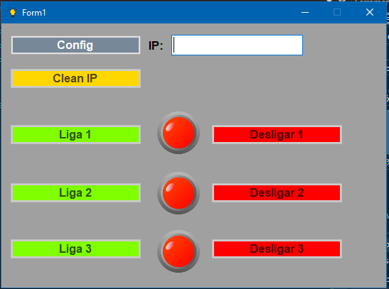
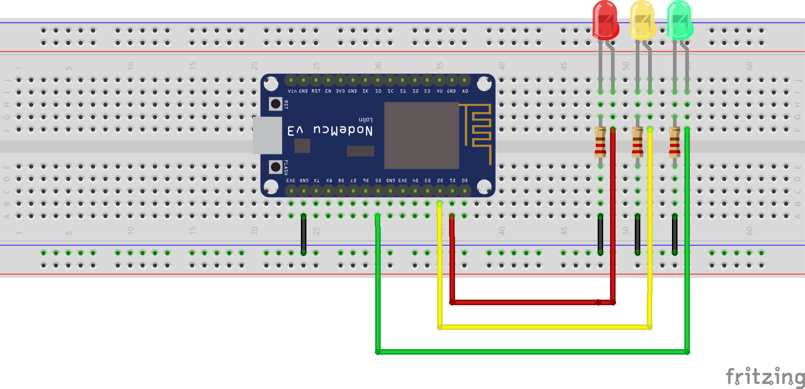
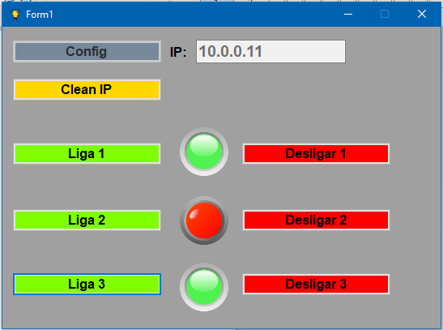

# **Interface gráfica windows em C# Windows Form .NET Framework**
#para acionar saídas digitais utilizando conexão Wifi com ESP8266 NodeMCU 
 
 
 

 
 

 
 

 
 
Obter o endereço ip do ESP8266 através do monitor serial Arduino IDE.
 
 
**Silas Almeida**